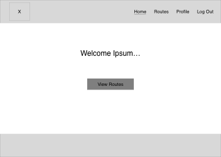
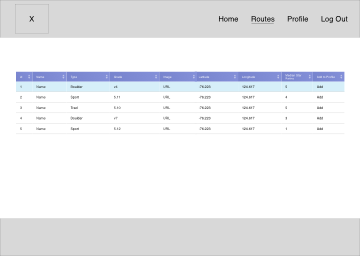
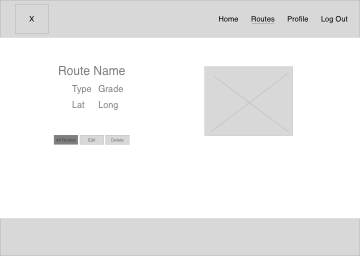
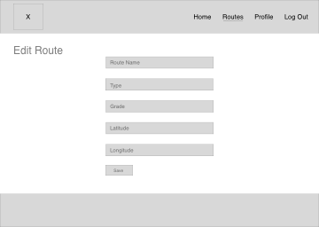
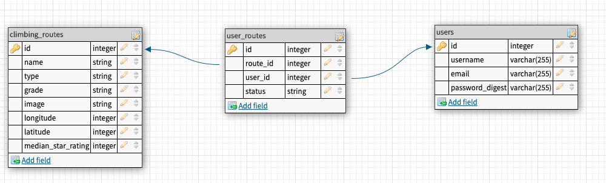

# betaBoulders
Find, save, edit, delete climbing routes

## User Stories
- User can browse (scroll) through existing climbing routes without logging in
- User can click on a route to view more information about it without logging in
- User can create an account
- User can log in to account
- User can save any existing routes to their profile
- User can view their routes on their profile
- User can remove routes from their profile
- User can log out

## Trello Board
- Will be built out [here](https://trello.com/b/vKJm1pRX/betaboulders) 

## Front end Wireframes
- Table sketch source [template](https://www.sketchappsources.com/free-source/3142-responsive-table-template-sketch-freebie-resource.html)
- Full-res wireframes [here](./assets/full_res_wireframes)

## Table Schemas

## CRUD Routes
|User Story|Route|
|-|-|
|See all routes|`GET /routes`|
|See route details|`GET /routes/:id`|
|Edit a route|`PUT /routes/:id`|
|Add a route|`POST /routes`|
|Delete a route|`DELETE /routes/:id`|
|Access create account page|`GET /users/new`|
|Create an account|`POST /users`|
|Access log in page|`GET /auth/login`|
|Log in|`POST /auth/login`|
|Save route to profile|`POST /users/:id/user_routes`|
|Log out|`GET /auth/logout`|

## Notes on Deployment
- Application will be deployed on Heroku
- `db/migrations` files must be run in Heroku bash to set up tables.
- `seed.js` must be run in Heroku bash to seed the `climbing_routes` table from Mountain Project's API.
- The `SECRET_KEY` in `seed.js` is supressed in an `.env`. You will need to request your own credentials from Mountain Project and add the key in your own `.env` file.

## Links and Resources
- Mountain Project API [here](https://www.mountainproject.com/data)